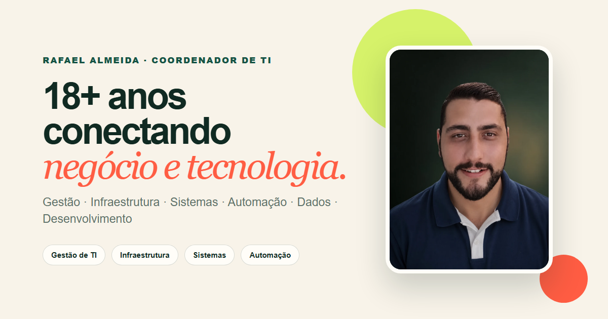

# Portfólio — Rafael Almeida

Portfólio profissional de Rafael Almeida, Coordenador de TI com atuação em gestão, infraestrutura, sistemas, dados, automação e desenvolvimento.

[Acessar o portfólio](https://portif-lio-iota-nine.vercel.app/) · [LinkedIn](https://www.linkedin.com/in/dealmeidasilva/) · [GitHub](https://github.com/ramagla)



## Proposta

Apresentar uma trajetória de mais de 18 anos em Tecnologia da Informação e demonstrar, por meio de cases, a capacidade de conectar necessidades de negócio a soluções seguras, integradas e sustentáveis.

## Cases selecionados

- **Portal de Gestão:** produto corporativo com indicadores, rotinas internas, integrações e infraestrutura.
- **SIB:** presença institucional responsiva com jornada direta de informação e contato.
- **Romeu Beauty:** experiência digital com serviços, portfólio, SEO e conversão.
- **Duda 16:** produto para evento com RSVP, mensagens, check-in e administração.

Repositórios corporativos ou que envolvem dados pessoais não são expostos pelo portfólio. Os detalhes técnicos podem ser apresentados em uma conversa profissional.

## Qualidade técnica

- React e TypeScript
- Layout responsivo e navegação mobile acessível
- SEO, Open Graph, Twitter Card e dados estruturados
- Vercel Web Analytics
- Prettier e build de produção validados automaticamente

## Desenvolvimento

```bash
npm install
npm start
```

## Validação

```bash
npx prettier --check src/App.tsx src/app.css src/data/portfolio.ts public/index.html
npm run build
```

## Créditos de marca

O logotipo Bizagi utilizado na seção de ferramentas é de ClaireBizagi, disponibilizado no Wikimedia Commons sob licença [CC BY-SA 4.0](https://creativecommons.org/licenses/by-sa/4.0/).
